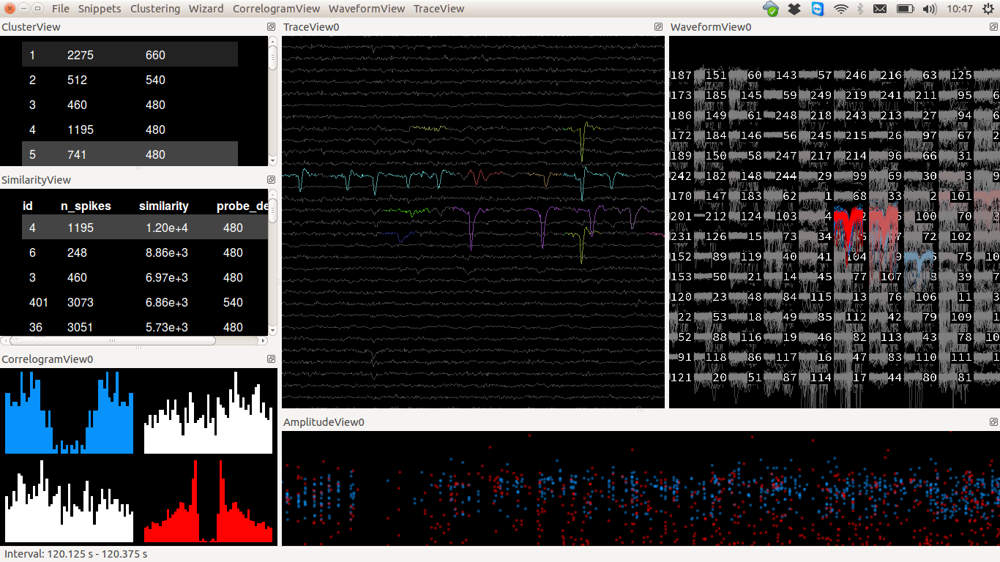

Panels of the GUIs
==================

In the following, we will mostly talk about the MATLAB GUI, because it is still the default one for the algorithm, but all the concepts are similar across all GUIs. 

.. warning::

	The phy GUI is way nicer, but is currently still under active development. We are not responsible for the possible bugs that may be encountered while using it.

Matlab GUI
----------

.. figure::  GUI.png
   :align:   center

   A view of the MATLAB_ GUI

As you can see, the GUI is divided in several panels:

* **A** A view of the templates
* **B** A view of the features that gave rise to this templates
* **C** A view of the amplitudes over time
* **D** A view for putative repeats, depending on your stimulation
* **E** A view of the Inter Spike Interval Distribution, for that given template
* **F** A view of the Auto/Cross Correlation (Press Show Correlation)

To know more about what to look in those views, see :doc:`Basis of Spike Sorting <../GUI/sorting>`

.. note::

    At any time, you can save the status of your sorting session, by pressing the ``Save`` Button. The suffix next to that box will be automatically added to the data, such that you do not erase anything.

    To reload a particular dataset, that have been saved with a special ``suffix``, you just need to do::

        >> circus-gui path/mydata.extension -e suffix

Python GUI
----------

   A view of the Python GUI, derived from phy_, and oriented toward template matching algorithm. To use it, you need a valid version of phy_, and phycontrib_

To know more about how to use phy_ and phylib_, see the devoted websites. If you want to have a exhaustive description of the sorting workflow performed with phy_, please see the `phy documentation <http://phy-contrib.readthedocs.io/en/latest/template-gui/>`_.

.. _phy: https://github.com/cortex-lab/phy
.. _MATLAB: http://fr.mathworks.com/products/matlab/
.. _phycontrib: https://github.com/cortex-lab/phylib

