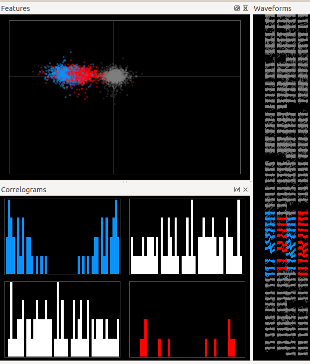

Panels of the GUI
=================

Matlab GUI
----------

.. figure::  GUI.png
   :align:   center

   A view of the MATLAB_ GUI

As you can see, the GUI is divided in several panels:

* **A** A view of the templates
* **B** A view of the features that gave rise to this templates
* **C** A view of the amplitudes over time
* **D** A view for putative repeats, depending on your stimulation
* **E** A view of the Inter Spike Interval Distribution, for that given template
* **F** A view of the Auto/Cross Correlation (Press Show Correlation)

To know more about what to look in those views, see :doc:`Basis of Spike Sorting <../GUI/sorting>`

Phy GUI
-------

   A view of the phy_ GUI

To know more about how to use phy_, see the devoted website.

.. _phy: https://github.com/kwikteam/phy
.. _MATLAB: http://fr.mathworks.com/products/matlab/

