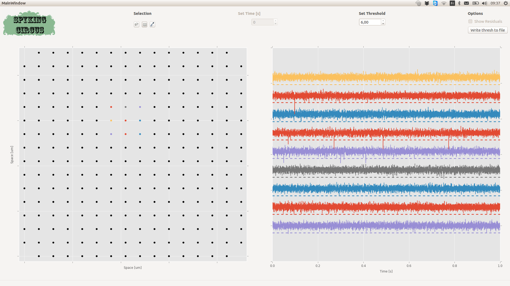
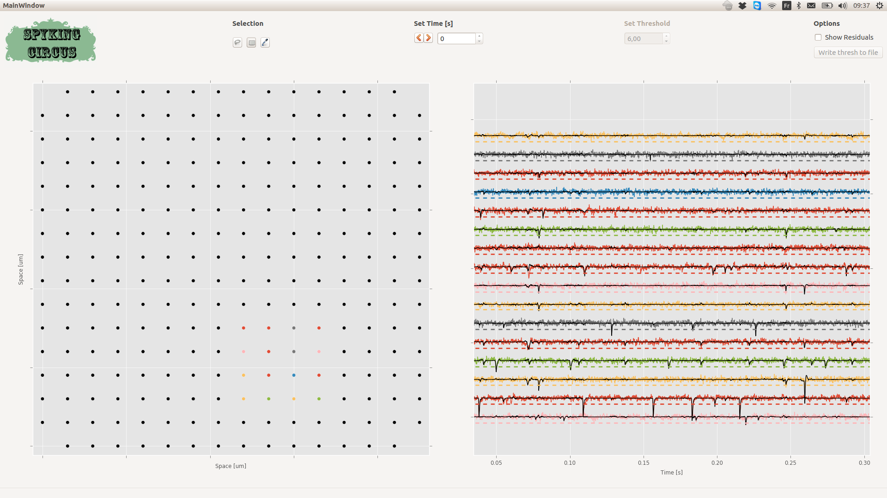

Quick preview GUIs
==================

Preview GUI
-----------

In order to be sure that the parameters in configuration file are correct, and before launching the algorithm that will filter the data on-site (and thus mess with them if parameters are wrong), one can use the preview GUI. To do so, simply do::

    >> spyking-circus path/mydata.extension -p

The GUI will display you the electrode mapping, and the first second of the data, filtered, with the detection thresholds as dashed dotted lines. You can then be sure that the value of spike_thresh used in the parameter file is correct for your own data.

   A snapshot of the preview GUI. You can click/select one or multiple electrodes, and see the 1s of the activity, filtered, on top with the detection threshold

Once you are happy with the way data are loaded, you can launch the algorithm. 

.. note::

	You can write down the value of the threshold to the configuration file by pressing the button ``Write thresh to file``

Result GUI
----------

In order to quickly visualize the results of the algorithm, and get a qualitative feeling of the reconstruction, you can see use a python GUI, similar to the previous one, showing the filtered traces superimposed with the reconstruction provided by the algorithm. To do so, simply do::

    >> spyking-circus path/mydata.extension -r

   A snapshot of the result GUI. You can click/select one or multiple electrodes, and see the the activity, filtered, on top with the reconstruction provided by the template matching algorithm (in black)

.. warning::

    If results are not there yet, the GUI will only show you the filtered traces

.. note::

	You can show the residuals, i.e. the differences between the raw data and the reconstruction by ticking the button ``Show residuals``

Meta-Merging GUI
----------------

See the devoted section on Meta-Merging (see :doc:`Automatic Merging <../code/merging>`)