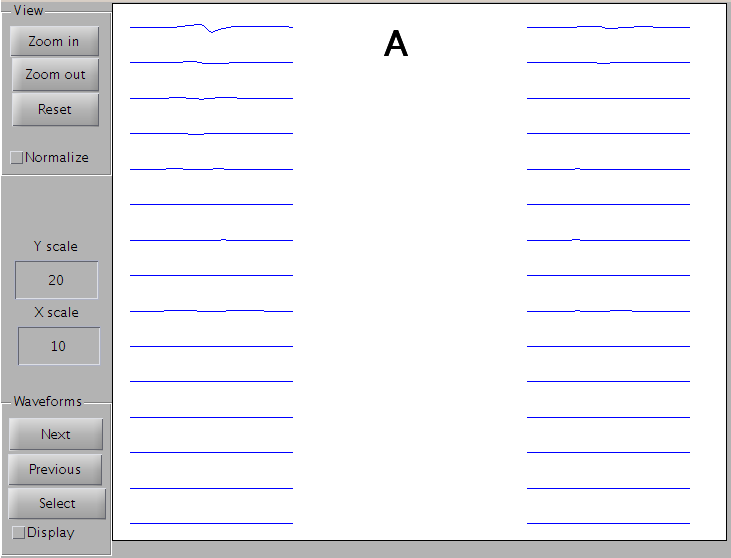
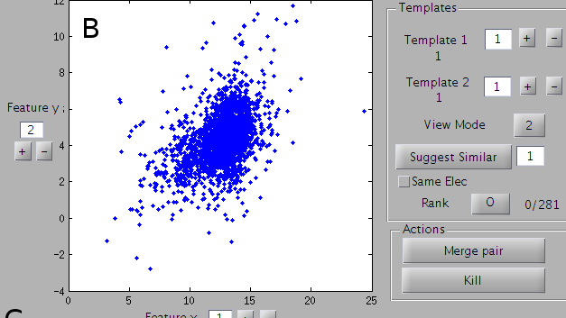
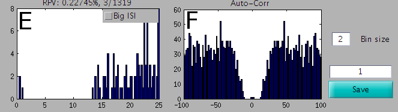
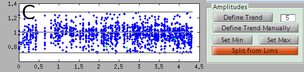
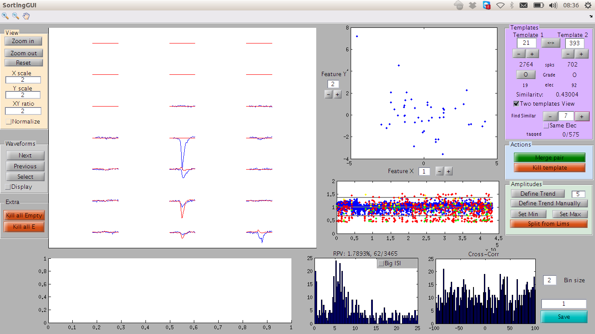

Core principles of spike sorting
================================

In this section, we will review the basis of spike sorting, and the key operations that are performed by a human operator, in order to review and assess the quality of the data. 

Viewing a single template
-------------------------

The algorithm outputs different templates. Each corresponds to the average waveform that a putative cell evokes on the electrodes. The index of the template displayed is on the top right corner. The index can be changed by typing a number on the box or clicking on the plus / minus buttons below it.

   A view of the templates

The large panel A shows the template on every electrode. You can click on the ``Zoom in`` and ``Zoom out`` buttons to get a closer look or step back.
``Reset`` will restaure the view to the default view. ``Normalize`` will automatically adapt the scale to see the most of your template.

   A view of the features

Panel B shows the cluster from which this template has been extracted. Unless you want to redefine the cluster, you don't have to worry about them (see the "going beyond" page for more information). You just need to check that the clustering did effectively split clusters.

   A view of the Inter-Spike Intervals and the AutoCorrelation

Panel E shows the ISI (inter spike interval). You can look at it from 0 to 25 ms, or from 0 to 200 ms if the button ``Big ISI`` is clicked. Above this panel, the % of refractory period violation is indicated, and a ratio indicates the number of violations / the total number of spikes.

If you click on the button ``Show corr``, panel F will show the auto-correlation. This is not automatically updated since it can take a moment to be estimated.

Viewing two templates
---------------------

All these panels can also be used to compare two templates. For this, define the second template in the ``Template 2`` box (top right), and click on the button ``View 2``. This button switches between viewing a single template or viewing two at the same time, in blue and red. In E, you will get the ISI of the merged spike trains, and in F the cross-correlogram between the two cells.

Suggestion of matches
~~~~~~~~~~~~~~~~~~~~~

At any time, you can ask the GUI to suggest you the closest template to the one you are currently looking at, by clicking on `Suggest Similar`

Cleaning the templates
----------------------

   A view of the amplitudes over time

The template is matched all over the data, with a different amplitude each time. Each point of panel C represents a match, the y-axis is the amplitude, and x the time. When there is a refractory period violation (two spikes too close), the bigger spike appears as a yellow point, and the smaller one in green. The 3 gray lines correspond to the average amplitude, the minimal amplitude and the maximal one.

Many templates should have a large number of amplitudes around 1, as a sanity check that the template matching algorithm is working. Howver, sometimes, some others can have amplitude that may be anormally small or large. These latter points are usually "wrong matches": they don't correspond to real occurrences of the template. Rather, the algorithm just fitted noise here, or the residual that remains after subtracting templates. Of course, you don't want to consider them as real spikes. So these amplitudes need to be separated from the other ones and removed.

.. warning::

    The minimal amplitude is now automatically handled during the fitting procedure, so there should not be a need for adjusting the lower amplitude

For this purpose, you need to define the limits of the area of good spikes. To define the minimal amplitude, click on the button ``Set Min``, and then click on the panel D. The gray line corresponding to the minimal amplitude will be adjusted to pass by the point on which you click. The process holds for ``Set Max``.

In some cases, for long recordings where you have a drift, you would like to have an amplitude threshold varying over time. To do so, you need to define first an average amplitude over time. Click on ``Define Trend`` and see if the gray line follows the average amplitude over time. If not, you can try to modify the number right next to the button: if its value is 10, the whole duration will be divided in 10 intervals, and the median amplitude will be over each of these intervals. Alternatively, you can define this average over time manually by clicking on the ``Define Trend Manually`` button, then click on all the places by which this trend should pass in panel D, and then press enter.

Once you have set the amplitude min and max correctly, you can split your template in two by clicking on the ``Split from Lims`` button. The template will be duplicated. One template will only keep the points inside these limits, the other ones will keep the points outside.

Destroying templates
--------------------

At any time, if you want to throw away a templates, because too noisy, you just need to click on the Button ``Kill``. The templates will be destroyed

.. warning::

    There is currently no ``Undo'' button in the MATLAB_ GUI. So please consider saving regularly your sorting session, or please consider using phy_

Merging two templates
---------------------

Very often a single cell is splitted by the algorithm into different templates. These templates thus need to be merged. When you are looking at one cell, click on the ``Suggest similar`` button to compare it to templates of similar shape. If the number next to this button, you will compare it to the most similar one, if it is 2, to the second most similar one, etc. You will be automatically switched to the ``View 2`` mode (see above). In the middle left, a number between 0 and 1 indicates a coefficient of similarity between the two templates (1=perfect similarity). By ticking the ``Normalize`` box, the two templates will be normalized to the same maximum.

There are many ways to decide if two templates should be merged or not, but most frequently people look at the cross-correlogram: if this is the same cell, there should be a clear dip in the middle of the cross-correlogram, indicating that two spikes of the two templates cannot be emitted to too close to each other, and thus respecting the refractory period.

   A view of the MATLAB GUI

To merge the two templates together, click on the ``Merge`` button. The spikes from the two cells will be merged, and only the template of the first one will be kept.

Note that the algorithm is rather on the side of over-dividing the cells into more templates, rather than the opposite, because it is much easier to merge cells than to cluster them further. So you will probably need to do that many times.

.. warning::

    We are working on a meta-merging algorithm that will automatize all this sorting process, and we hope to add it soon into the main code of the SpyKING CIRCUS.

Give a grade to a cell
----------------------

Once you have merged a cell and are happy about it, you can give it a grade by clicking on the ``O`` button. Clicking several times on it will go through different letters from A to E. This extra information can be helpful depending on the analysis you want to perform with your data.

Saving your results
-------------------

To save the results of your post-processing, click on the ``Save`` button. A number of files will be saved, with the suffix written in the box right next to the save button.

.. _phy: https://github.com/kwikteam/phy
.. _MATLAB: http://fr.mathworks.com/products/matlab/

