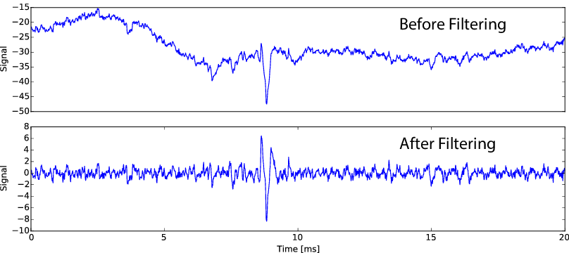
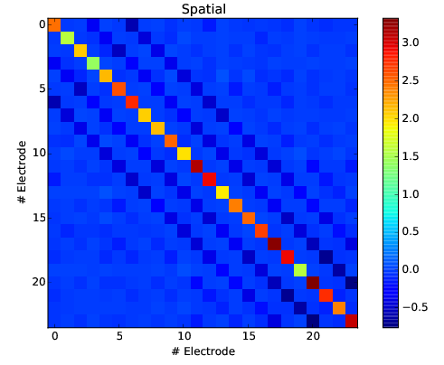
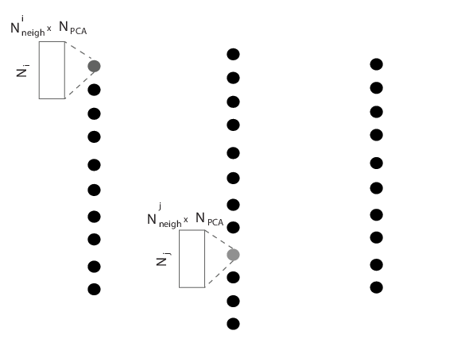
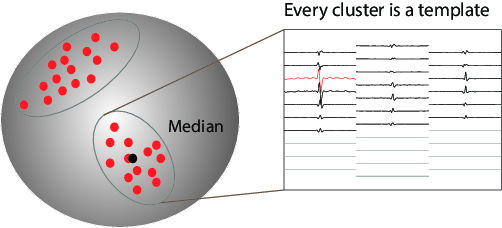
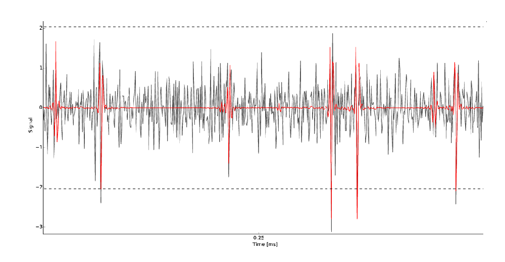

Details of the algorithm
========================

The full details of the algorithm have not been published yet, so we will only draft here the key principles and describe the ideas behind the four key steps of the algorithm. If you can not wait and really would like to know more about all its parameters, please get in touch with pierre.yger@inserm.fr

.. note::

   A full publication showing details/results of the algorithm is available at http://biorxiv.org/content/early/2016/08/04/067843

Filtering
---------

In this first step, nothing incredibly fancy is happening. All the channels are high-pass filtered in order to remove fluctuations, and to do so, we used a classical third order Butterworth filter. This step is required for the algorithm to work. 

   Raw vs. Filtered data

Whitening
---------

In this step, we are removing the spurious spatio-temporal correlations that may exist between all the channels. By detecting temporal periods in the data without any spikes, we compute a spatial matrix and a temporal filter that are whitening the data. This is a key step in most signal processing algorithms. 

.. warning::

    Because of this transformation, all the templates and data that are seen after in the MATLAB_ GUI are in fact seen in this whitened space.

   spatial matrix to perform the whitening of the data for 24 electrodes

Clustering
----------

This is the main step of the algorithm, the one that allows it to perform a good clustering in a high dimensional space, with a smart sub sampling. 

A divide and conquer approach
~~~~~~~~~~~~~~~~~~~~~~~~~~~~~

First, we split the problem by pooling spikes per electrodes, such that we can perform *N* independent clusterings (one per electrode), instead of a giant one. By doing so, the problem becomes intrinsically parallel, and one could easily use MPI to split the load over several nodes.

   Every spikes is assigned to only one given electrode, such that we can split the clustering problem into *N* independent clusterings.

A smart and robust clustering
~~~~~~~~~~~~~~~~~~~~~~~~~~~~~

We expanded on recent clustering technique `[Rodriguez et Laio, 2014] <http://www.sciencemag.org/content/344/6191/1492.short>`_ and designed a  fully automated method for clustering the data without being biased by density peaks. In fact, the good point about the template matching approach that we are using is that we just need the *averaged* waveforms, so we don't need to perform a clustering on all the spikes. Therefore, we can cluster only on a subset of all the spikes. They key point is to get a correct subset. Imagine that you have two cells next to the same electrode, but one firing way more than the other. If you are just subsampling by picking random spikes next to that electrode, you are likely to miss the under-represented neuron. The code is able to solve this issue, and perform what we call a *smart* search of spikes in order to subsample. Details should be published soon.

   Clustering with smart subsampling in a high dimensional space, leading to spatio-temporal templates for spiking activity triggered on the recording electrodes

Fitting
-------

The fitting procedure is a greedy template matching algorithm, inspired by the following publication `[Marre et al, 2012] <http://http://www.jneurosci.org/content/32/43/14859.abstract>`_. The signal is reconstructed as a linear sum of the templates, and therefore, it can solve the problem of overlapping spikes. The good point of such an algorithm is that small temporal chunks can be processed individually (allowing to split the load among several computing units), and that most of the operations performed are matrix operations, thus this can gain a lot from the computing power of modern GPUs.

   Raw trace on a given electrode and superimposed templates in red. Each time the detection threshold (in dash dotted line) is crossed, the code lookup in the dictionary of template if a match can be found. 

.. _MATLAB: http://fr.mathworks.com/products/matlab/
