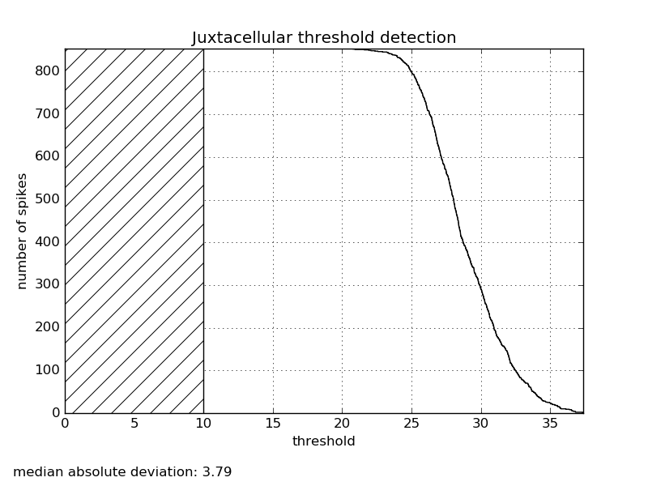
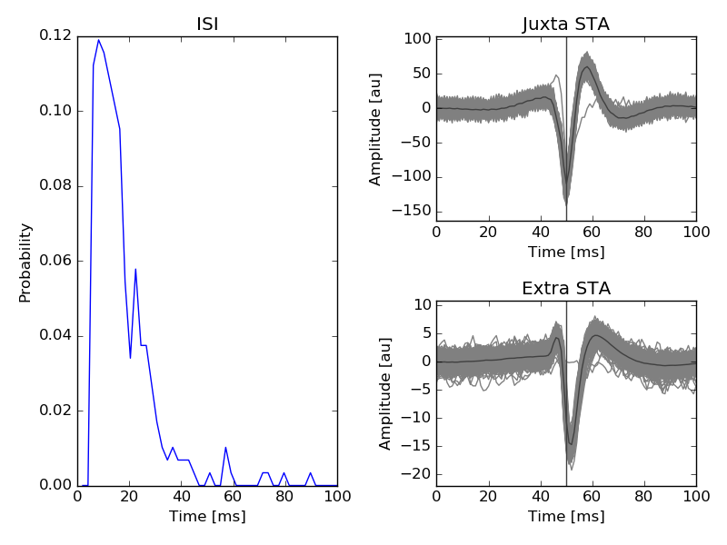
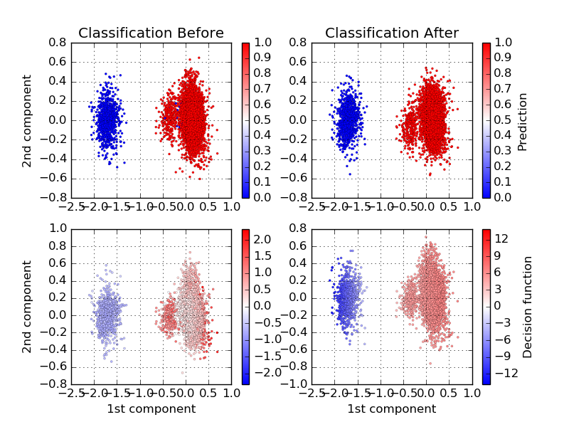
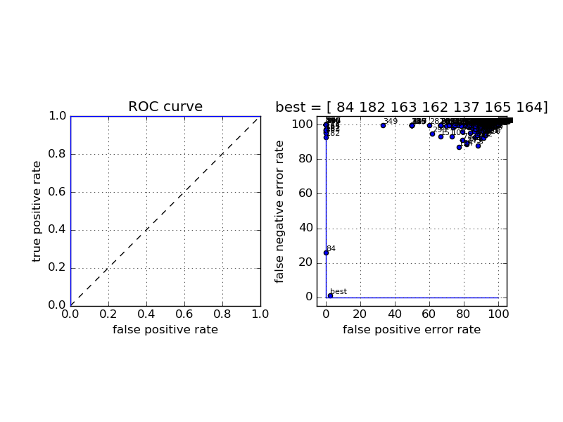

BEER estimate
=============

Validating
----------

The code comes with an integrated way to measure the optimal performance of any spike sorting algorithm, given the spike times of a ground truth neuron present in the recording. This can be used by doing::

    >> spyking-circus mydata.extension -m validating

To use it, you need to have, if your datafile is ``mydata.extension``, a file named ``mydata/mydata.juxta.dat`` which is the juxta-cellular signal recorded next to your extracelullar channels. Note that if you have simply the spike times, there is a way to bypass this.

BEER estimate
-------------

In a nutshell, to quantify the performance the software with real ground-truth recordings, the code can compute the Best Ellispsiodal Error Rate (BEER), as described in `[Harris et al, 2000] <http://robotics.caltech.edu/~zoran/Reading/buzsaki00.pdf>`_. This BEER estimate gives an upper bound on the performance of any clustering-based spike sorting method using elliptical cluster boundaries, such as the one described in our paper. After thresholding and feature extraction, the windowed segments of the trace are labeled according to whether or not they contained a true spike. Half of this labeled data set is then used to train a perceptron whose decision rule is a linear combination of all pairwise products of the features of each segment, and is thus capable of achieving any elliptical decision boundary. This decision boundary is then used to predict the occurrence of spikes in the segments in the remaining half of the labeled data, and the success or failure of these predictions then provide an estimate of the miss and false positive rates.

The code will generate a file ``mydata/mydata.beer.dat`` storing all the needed information, and will produce several plots.

   Distribution of the number of juxta-cellular spikes as function of the detection thresholds (to know where it has to be defined)

   ISI and mean waveforms triggered by the juxta-cellular spikes

   Decision boundaries of the BEER classifier before and after learning.

   The complete ROC curve for the classifier, and all the templates found by the algorithm, superimposed.

If you are interested by using such a feature, please contact us!

.. _phy: https://github.com/kwikteam/phy
.. _MATLAB: http://fr.mathworks.com/products/matlab/

