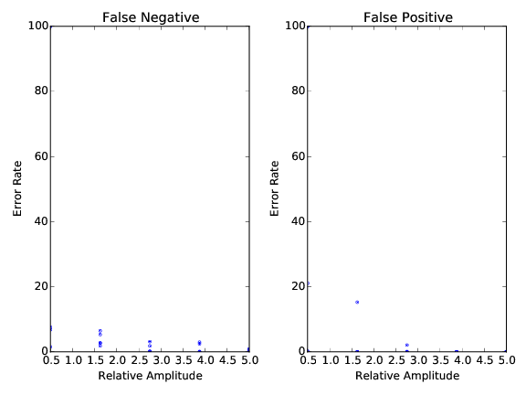

Launching the tests
===================

The code has now a dedicated testsuite, that will not only test that the code can be launched, but it will also perform some stress tests that will convince you that the code is doing things right. In order to launch the tests, you simply need to do::

    >> nosetests tests/

If you have ``nose`` installed. You can also only launch some particular tests only::

    >> nosetests tests/test_complete_workflow.py

.. note::

    The testsuite is taking some time, because various datasets are generated and processed, so you should not be in a hurry.

What is performed
-----------------

When you are launching the tests, the code will generate a completly artificial datasets of 5min at 20kHz, composed of some templates with Gaussian noise, on 30 channels. This source dataset is saved in ``tests/data/data.dat``. 

.. note::

    If you copy your own dataset in ``tests/data``, then the tests will use it!

What to see
-----------

At the end of every tests, some particular datasets generated using the ``bencharmking`` mode are stored in ``tests/synthetic/``, and plots are generated in ``tests/plots/``

    Plots of the tests for the complete workflow. 25 templates at various rates/amplitudes are injected into the source datasets, and performance are shown here.