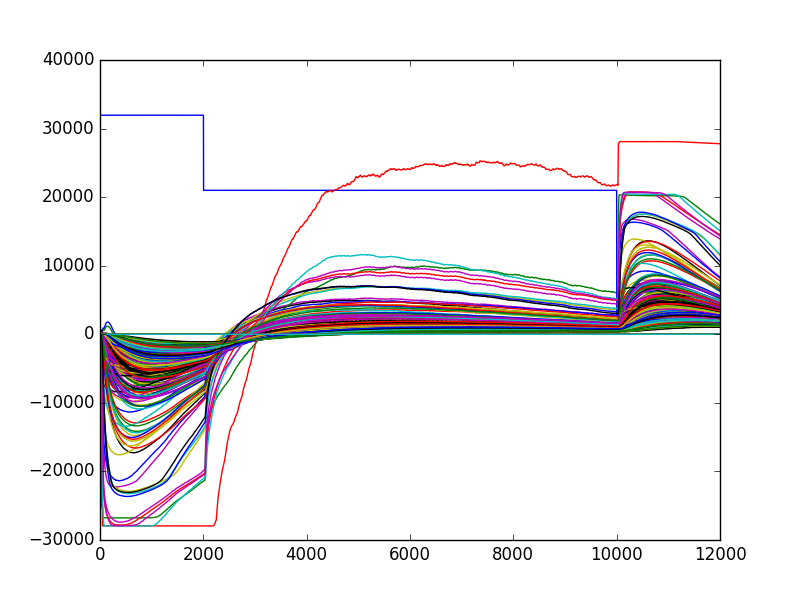

Dealing with stimulation artifacts
==================================

Sometimes, because of external stimulation, you may end up having some artifacts on top of your recordings. For example, in case of optogenetic stimulation, shinning light next to your recording electrode is likely to contaminate the recording. Or it could be that those artifacts are simply affecting some portions of your recordings that you would like easily to ignore. The code has several built-in mechanisms to deal with those artifacts, in the ``triggers`` section of the parameter file. 

Ignore some saturation artifacts
--------------------------------

Your recording device might, sometimes, because of external stimulation, lead to saturation. This can be problematic, especially because after filtering, the saturation times will give rise to ringing artifacts that might affect the quality of the sorting. You can prevent such a situation with the ``sat_value`` paramater in the ``[filtering]`` section. This value, expressed as a percentage of the maximal range allowed by your data dtype, will specify when the software should decide that such values are saturated. The times and values of saturation, per channel, will be logged in a file, and during the filtering procedure, all these values will be set to 0 in the filtered data. 

Ignore some portions of the recording
-------------------------------------

You can decide to ignore some portions of the recordings, because they are corrupted by artifacts.

Setting dead periods
~~~~~~~~~~~~~~~~~~~~

In a text file, you must specify all the portions [t_start, t_stop] that you want to exclude from analysis. The times can be given in ms or in timesteps, and this can be changed with the ``dead_unit`` parameter. By default, they are assumed to be in ms. Assuming we want to exclude the first 500ms of every second, such a text file will look like::
	
    // myartifacts.dead
    // Exclude 500 ms every 1000 ms from t=0 until t=10 seg
    // times are given in 'ms' (set dead_unit = 'ms' in [triggers]
    // columns: t_start t_stop
	0 500 
	1000 1500 # this is a comment
	2000 2500
	...
	10000 10500

All t_start/t_stop times here in the text file are in ms, and you must use one line per portion to exclude. Use ``dead_unit`` if you want to give times in timesteps.

How to use it
~~~~~~~~~~~~~

Once this file have been created, you should provide them in the ``[triggers]`` section of the code (see :doc:`here <../code/config>`) with the ``dead_file`` parameter. You should then activate the option ``ignore_times`` by setting it to ``True``. Once the code is launched, all steps (whitening/clustering/fitting) will only work on spikes that are not in the  time periods defined by the ``dead_file``.

Discard the unphysiological spikes
----------------------------------

If you want to exclude the unphysiological spikes, and/or residual artifacts that might exists in your data to be considered by the software during its internal steps (clustering, fitting), then you can use the 
``weird_thresh`` parameter in the ``[detection]`` section. By default, all spikes above a certain threshold (in MAD) are considered. But if a ``weird_thresh`` value is specified, all threshold crossings higher than such a value will be discarded. Note that you should use that only if you have a lots of such events. Because if there are only few, the code should be rather robust.

Subtract regularly occurring artifacts
--------------------------------------

In a nutshell, the code is able, from a list of stimulation times, to simply compute an median-based average artifacts, and subtract it automatically to the signal during the filtering procedure.

Setting stimulation times
~~~~~~~~~~~~~~~~~~~~~~~~~

In a first text file, you must specify all the times of your artifacts, identified by a given identifier. The times can be given in ms or in timesteps, and this can be changed with the ``trig_unit`` parameter. By default, they are assumed to be in ms. For example, imagine you have 2 different stimulation protocols, each one inducing a different artifacts. The text file will look like::
	
	// mytimes.triggers
    // Two interleaved stim (0 and 1) are
    // played at various times, roughly every
    // 500 ms
	0 500.2 
	1 1000.2
	0 1500.3
	1 2000.1 # this is a comment
	...
	0 27364.1
	1 80402.4

This means that stim 0 is displayed at 500.2ms, then stim 1 at 1000.2ms, and so on. All times in the text file are in ms, and you must use one line per time. Use ``trig_unit`` if you want to give times in timesteps.

Setting time windows
~~~~~~~~~~~~~~~~~~~~

In a second text file, you must tell the algorithm what is the time window you want to consider for a given artifacts. Using the same example, and assuming that stim 0 produces an artifacts of 100ms, while stim 1 produces a longer artifacts of 510ms, the file should look like::

	// Estimated duration of the artifacts
	// Stim 0 lasts 100 ms
	// Stim 1 lasts 510 ms
	0 100 # short opto flash
	1 510 # long opto flash

Here, again, use ``trig_unit`` if you want to provide times in timesteps.

How to use it
~~~~~~~~~~~~~

Once those two files have been created, you should provide them in the ``[triggers]`` section of the code (see :doc:`here <../code/config>`) with the ``trig_file`` and ``trig_windows`` parameters. You should then activate the option ``clean_artifacts`` by setting it to ``True`` before launching the filtering step. Note that by default, the code will produce one plot by artifacts, showing its temporal time course on all channels, during the imposed time window. This is what is subtracted, at all the given times for this unique stimulation artifacts.

   Example of a stimulation artifacts on a 252 MEA, subtracted during the filtering part of the algorithm.

.. note::

	If, for some reasons, you want to relaunch this step (too small time windows, not enough artifacts, ...) you will need to copy again the raw data before relaunching the filtering. This is because remember that the raw data are *always* filtered on-site.
