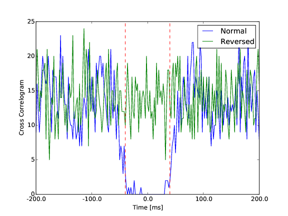
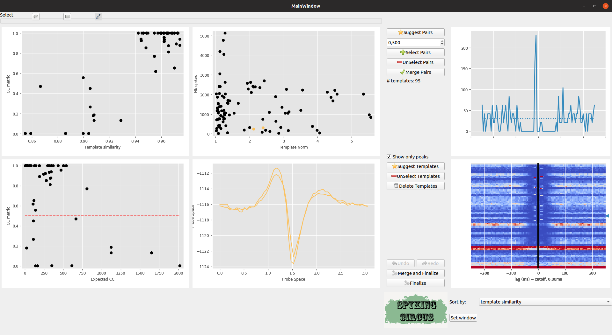
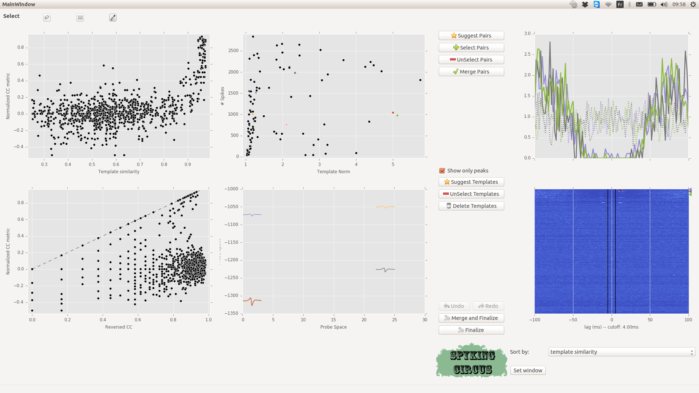
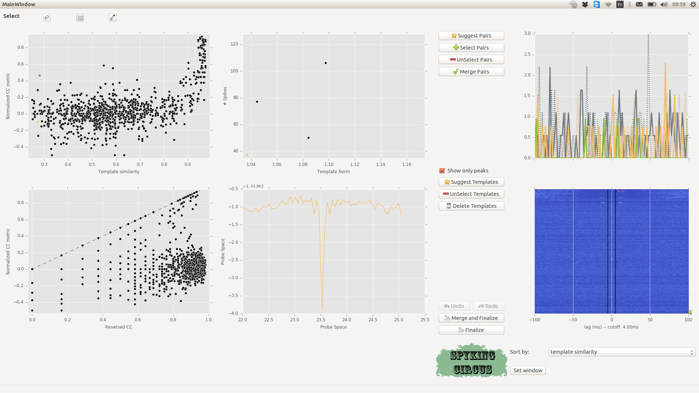

Automatic Merging
=================

Need for an meta merging step
----------------------------------

Because for high number of channels, the chance that a cell can be splitted among several templates are high, one need to merge putative templates belonging to the same cells. This is a classical step in most of the spike sorting technique, and tradionnaly, this step was performed by a human operator, reviewing all templates one by one. Problem is that with the new generation of dense probes that the code can handle (4225 channels), the output of the algorithm can lead to more than 1000 templates, and one can not expect a human to go through all pairs iteratively.

To automatize the procedure, we developped a so-called meta-merging step that will allow to quickly identify pairs of templates that have to be merged. To do so, first, we consider only pairs that have a similarity between their templates higher than ``cc_overlap``. This allow not to considerate all the possible pairs, but only those that are likely to be the same cells, because their templates are similar. 

Comparison of CrossCorrelograms
-------------------------------

Then, for all those pairs of cells, we are computing the cross-correlation function in a time window of [-100, 100] ms, with a particular time bin ``cc_bin``. The rationale behind is that a pair of template that should be merged should have a dip in the center of its cross-correlogram. To quantify that in an automated manner, we compute a control cross-correlogram in the same window of interest, but by reverting in time the spikes of cell 2. This allow us to compare the normal cross-correlogram between the two cells to a "control" one, keeping the same amount of correlation (see Figure).

   Difference between a normal cross-correlogram for a given pair of cells, and a control version where the spikes from the second cells are reversed in time. The center area in between the red dash dotted line is the one of interest.

To quantify the dip, we measure the difference between the cross correlogram and its shuffled version in a window of interest [``-cc_average``, ``cc_average``].

An iterative procedure with a dedicated GUI
-------------------------------------------

We design a Python GUI to quickly visualize all those values and allow human to quickly performs all merges that need to be done. To launch it, with *N* processors, you need to do::

    >> spykig-circus mydata.extension -m merging -c N

The GUI is still an ongoing work, so any feedbacks are welcome, but the idea is to show, in a single plot, all the putative pairs of cells that have to be merged. As can be seen in the top left panel, every point is a pair of neuron, and x-axis in the upper left panel shows the template similarity (between ``cc_merge`` and 1), while y-axis show the normalized difference between the control CC and the normal CC (see above). In the bottom left plot, this is the same measure on the y-axis, while the x-axis only shows the CC of the Reverse Cross-Correlogram. **Any pairs along the diagonal are likely to be merged**

    Meta-merging GUI

Selecting pairs
~~~~~~~~~~~~~~~

Each time you click on a given pairs (or select a group of them with the rectangle or lasso selector), the corresponding Cross-Correlogram are shown in the top right panel (and in dash-dotted line, this is the control). As you can see, there is a clear group of pairs that have a high template similarity > 0.9, and a high value for the CC metric >0.5. So we can select some of them

    Meta-merging GUI with several pairs that are selected

If you think that all those pairs should be merged, you just need to click on the ``Select`` Button, and then on ``Merge``. Once the merge is done, the GUI will recompute values and you can iterate the process

.. note::

  The ``Suggest Pairs`` button suggests you pairs of neurons that have a template similarity higher than 0.9, and a high value for the CC metric

Changing the lag
~~~~~~~~~~~~~~~~

By default, the CC metric is computed within a temporal window of [-5, 5] ms. But this value can be changed if you click on the ``Set Window`` Button. In the bottom right panel, you see all the CC for all pairs. You can change the way you want them to be sorted, and you can also click there to select some particular pairs.

Correcting for temporal lags while merging templates
~~~~~~~~~~~~~~~~~~~~~~~~~~~~~~~~~~~~~~~~~~~~~~~~~~~~

By default, in the GUI, when a merge between two templates is performed, the spikes of the destroyed template are just assigned to the one that is kept. This is a valid assumption is most cases. However, if you want to be more accurate, you need to take into account a possible time shift between the two templates. This is especially True if you are detecting both positive and negative peaks. If a template is large enough to cross both positive and negative thresholds, two time shifted versions of the same template could exist. One will be centered on the positive peak, and one centered on the negative peak. So when you merge them, you need to apply to the spikes this time shift between the templates. This can be done if you set the ``correct_lag`` flag in the ``[merging]`` section of the parameter file to ``True``. 

Exploring Templates
~~~~~~~~~~~~~~~~~~~

In the middle, top plot, you can see on the x-axis the ratio between the peak of the template, and the detection threshold on its prefered electrode, and on the y-axis the number of spikes for that given templates. If you click on those points, you'll see in the middle bottom plot the template waveform on its prefered electrode. 

.. note::

    The ``Suggest Templates`` button suggests you templates that have a peak below or just at the detection threshold. Those templates can exist, because of noise during the clustering phase. They are likely to be False templates, because the detection thresholds may have been set too low

    Meta-merging GUI with several templates that are selected

You can then delete those templates, and the GUI will recompute the scores for all pairs. 

Saving the results
~~~~~~~~~~~~~~~~~~

When you think all merges have been done, you just need to press the ``Finalize`` Button. This will save everything to file, without overwritting your original results. In fact, it will create new files with the suffix ``-merged``, such that you need to use that suffix after if you want to view results in the GUI. Thus, if you want to convert/view those results after, you need to do::

  >> circus-gui-matlab mydata.extension -e merged