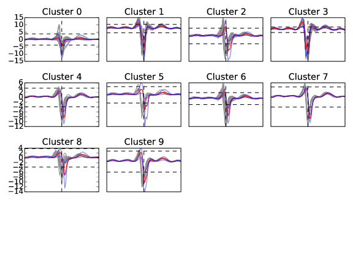

Sanity plots
============

In order to have a better feedback on what the algorithm is doing, and especially the clustering phase, the code can produce sanity plots that may be helpful to troubleshoot. This is the flag ``make_plots`` in the ``clustering`` section of the parameter files (see the configuration section :doc:`documentation on MPI <../code/config>`). All plots will be stored in the folder ``path/mydata/plots``

.. note:: 

	If you do not care about those plots, you can set to ``None`` the ``make_plots`` entries in the configuration file, and this will speed up the algorithm

View of the activity
--------------------

The best way to visualize the activity on your electrodes, and to see if data are properly loaded or if results are making any sense is to use the devoted python GUI and the preview mode (see the visualization section :doc:`on Python GUI <../GUI/python>`)

Views of the Clusters
---------------------

During the clustering phase, the algorithm will save files names ``cluster_i`` where *i* is the number of the electrode. A typical plot will look like that

.. figure::  clusters_50.png
   :align:   center

   A view on the clusters detected by the algorithm, on a given electrode

On the two plots in the left column, you can see the rho vs delta plots (see `[Rodriguez et Laio, 2014] <http://www.sciencemag.org/content/344/6191/1492.short>`_). Top plots shows the centroids that have been selected, and bottom plots shows in red all the putative centers that were considered by the algorithm.

On the 4 plots on the rights, this is a 3D projection of all the spikes collected by that electrode, projected along different axes: x vs y, y vs z and x vs z.

.. note::

    If, in those plots, you see clusters that you would have rather split, and that do not have different color, then this is likely that the clustering algorithm had wrong parameters. Remember that in the configuration file ``max_clusters`` controls the maximal number of clusters per electrodes that will be searched (so you may want to increase it if clustering is not accurate enough), and that ``sim_same_elec`` will control how much similar clusters will be merged. So again, decrease it if you think you are losing some obvious clusters.

Views of the waveforms
----------------------

At the end of the clustering phase, the algorithm will save files names ``waveform_i`` where *i* is the number of the electrode. A typical plot will look like that

   A view on the templates, on a given electrode

On this plot, you should get an insight on the templates that have been computed out of the clustering phase. For all the clusters detected on that given electrode, you should see all the waveforms peaking on that particular electrode, and the template, in red (in blue, this is the min and max amplitudes allowed during the fitting procedure). Note that if template is not aligned with the waveforms, this is normal. The templates are aligned on the electrodes were they have an absolute min. Here you are just looking at them on a particular electrode. The key point is that, as you can see, templates should all go below threshold on that particular electrode (dash-dotted line). When the template is flat, it means that it has been removed from the dictionary, because of time shifting and duplication elsewhere.