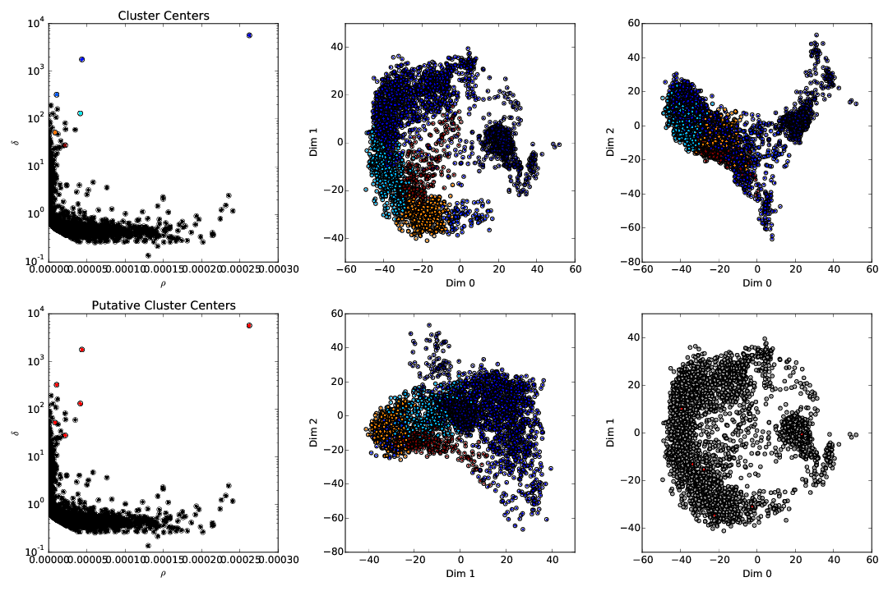

Sanity plots
============

In order to have a better feedback on what the algorithm is doing, and especially the clustering phase, the code can produce sanity plots that may be helpful to troubleshoot. This is the flag ``make_plots`` in the ``clustering`` section of the parameter files (see the configuration section :doc:`documentation on MPI <../code/config>`). All plots will be stored in the folder **path/mydata/plots**

Views of the Clusters
---------------------

During the clustering phase, the algorithm will save files names ``cluster_i.pdf`` where *i* is the number of the electrode. A typical plot will look like that

   A view on the clusters detected by the algorithm, on a given electrode

On the two plots in the left column, you can see the rho vs delta plots (see REFERENCE). Top plots shows the centroids that have been selected, and bottom plots shows in red all the putative centers that were considered by the algorithm.

On the 4 plots on the rights, this is a 3D projection of all the spikes collected by that electrode, projected along different axes: x vs y, y vs z and x vs z.

.. warning::

    If, in those plots, you see clusters that you would have rather split, and that do not have different color, then this is likely that the clustering algorithm had wrong parameters. Remember that in the configuration file ``max_clusters`` controls the maximal number of clusters per electrodes that will be searched (so you may want to increase it if clustering is not accurate enough), and that ``sim_same_elec`` will control how much similar clusters will be merged. So again, decrease it if you think you are losing some obvisous clusters.

Views of the waveforms
----------------------

At the end of the clustering phase, the algorithm will save files names ``waveform_i.pdf`` where *i* is the number of the electrode. A typical plot will look like that

   A view on the templates, on a given electrode

On this plot, you should get an insight on the templates that have been computed out of the clustering phase.
