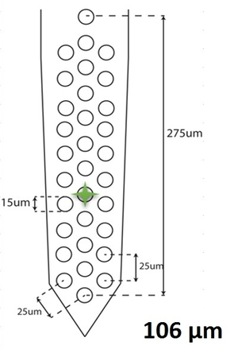

Designing your probe file
=========================

What is the probe file?
-----------------------

In order to launch the code, you must specify a mapping for your electrode, i.e you must tell the code how your recorded data can be mapped onto the physical space, and what is the spatial position of all your channels. Examples of such probe files (with the extension ``.prb``) can be seen in the ``probes`` folder of the code. They will all look like the following one::

    total_nb_channels = 32
    radius            = 100

    channel_groups = {
        1: {
            'channels': list(range(32)),
            'graph' : [],
            'geometry': {
                0:  [  0.0 ,   0.0],
                1:  [  0.0 ,  50.0],
                2:  [+21.65, 262.5],
                3:  [+21.65, 237.5],
                4:  [+21.65, 187.5],
                5:  [+21.65, 137.5],
                6:  [+21.65,  87.5],
                7:  [+21.65,  37.5],
                8:  [  0.0 , 200.0],
                9:  [  0.0 , 250.0],
                10: [+21.65,  62.5],
                11: [+21.65, 112.5],
                12: [+21.65, 162.5],
                13: [+21.65, 212.5],
                14: [  0.0 , 150.0],
                15: [  0.0 , 100.0],
                16: [  0.0 , 125.0],
                17: [  0.0 , 175.0],
                18: [-21.65, 212.5],
                19: [-21.65, 162.5],
                20: [-21.65, 112.5],
                21: [-21.65,  62.5],
                22: [  0.0 , 275.0],
                23: [  0.0 , 225.0],
                24: [-21.65,  37.5],
                25: [-21.65,  87.5],
                26: [-21.65, 137.5],
                27: [-21.65, 187.5],
                28: [-21.65, 237.5],
                29: [-21.65, 262.5],
                30: [  0.0 ,  75.0],
                31: [  0.0 ,  25.0],
            }
        }
    }

   An example of a probe mapping, taken from `Adam Kampff <http://www.kampff-lab.org/>`_

This ``prb`` format is inherited from the phy_ documentation, in order to ensure compatibility. 

Key parameters
--------------

As you can see, an extra requirement of the SpyKING CIRCUS is that you specify, at the top of the probe file, two parameters:

* ``total_nb_channels``: The total number of channels currently recorded. This has to be the number of rows in your data file

* ``radius``: The default spatial extent [in um] of the templates that will be considered for that given probe. Note that for *in vitro* recording, such as the MEA with 252 channels, a spike can usually be seen in a physical radius of 250um. For *in vivo* data, 100um seems like a more reasonable value. You can change this value in the parameter file generated by the algorithm (see :doc:`documentation on the configuration file <../code/config>`)

Channel groups
--------------

The channel_group is a python dictionary where you'll specify, for every electrodes (you can have several of them), the exact geometry of all the recording sites on that probe, and what are the channels that should be processed by the algorithm. To be more explicit, in the previous example, there is one entry in the dictionary (with key 1), and this entry is itself a dictionary with three entries:

* ``channels``: The list of the channels that will be considered by the algorithm. Note that even if your electrode has *N* channels, some can be discarded if they are not listed in this ``channels`` list.

* ``graph``: Not used by the SpyKING CIRCUS, only here to ensure compatibility with phy_

* ``geometry``: This is where you have to specify all the physical positions of your channels. This is itself a dictionary, whose entries are the number of the channels, and whose values are the position [in um], of the recoding sites on your probe.

.. note::

    You only need, in the ``geometry`` dictionary, to have entries for the channels you are listing in the ``channels`` list. The code only needs positions for analyzed channels

Examples
--------

By default, during the install process, the code should copy some default probe files into ``/home/user/spyking-circus/probes``. You can have a look at them.

How do deal with several shanks ?
---------------------------------

There are two ways to simply handle several shanks:

* in the ``.prb`` file, you can create a single large channel group, where all the shanks are far enough (for example in the x direction), such that templates will not interact (based on the physical ``radius``). If your radius is 200umm, for example, if you set x to 0 for the first shank, 300 for the second one, and so on, templates will be confined per shank.

* in the ``.prb`` file, you can also have several channel groups (see for example adrien.prb in the probes folder). What is done by the code, then, is that during internal computations templates are confined to each channel groups. However, for graphical purpose, when you'll use the GUI, the global x/y coordinates across all shanks are used. Therefore, if you do not want to have them plotted on top of each other, you still need to add a x/y padding for all of them.

How do deal with dead channels ?
--------------------------------

You have two ways to deal with channels that you want to discard from the analysis:

* in the ``.prb`` file, you can specify a given list of channels to analyse ``channels`` that may not have all the recorded channels. For example, if you have a probe with 32 channels, but ``channels`` set to range(28), then the two last channels will be ignored

* with the ``dead_channels`` parameter of the configuration file. Coming back to the previous example, you can set such a parameter to {1 : [28, 29]} in order to exclude the last two channels

.. _phy: https://github.com/cortex-lab/phy