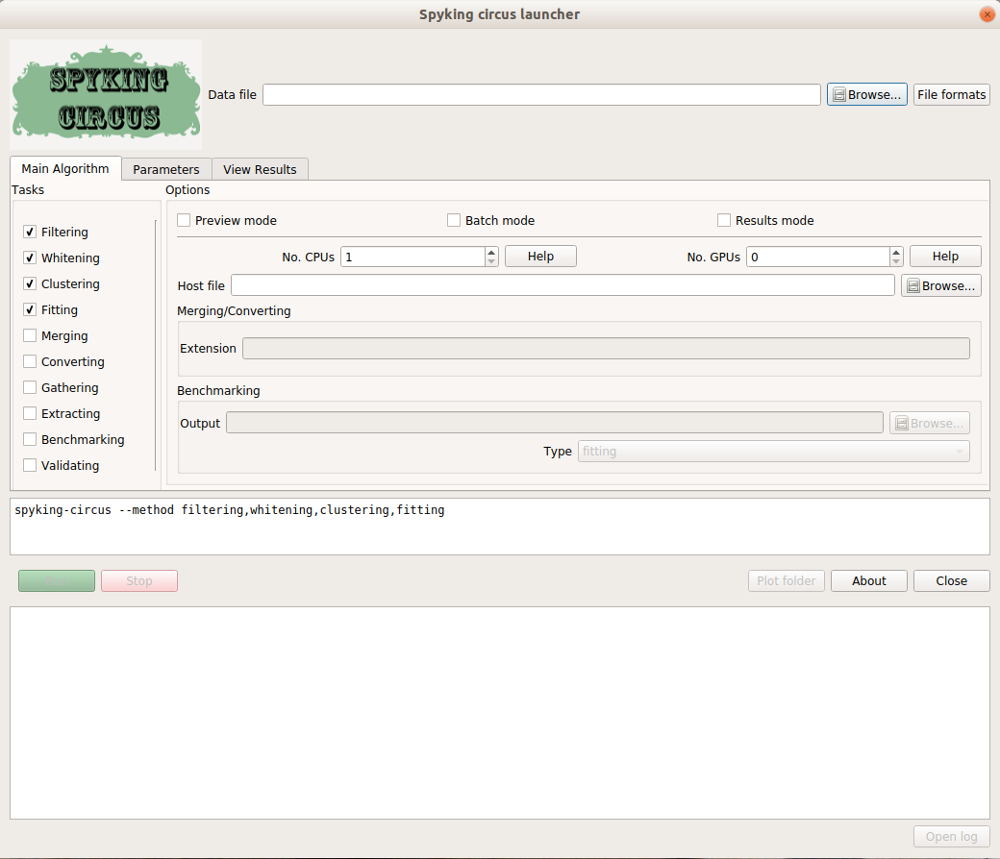

.. SpyKING CIRCUS documentation master file, created by
   sphinx-quickstart on Mon Oct  5 13:34:57 2015.
   You can adapt this file completely to your liking, but it should at least
   contain the root `toctree` directive.

Welcome to the SpyKING CIRCUS's documentation!
==============================================

.. figure::  circus.png
   :align:   center

The SpyKING CIRCUS is a massively parallel code to perform semi automatic spike sorting on large extra-cellular recordings. Using a smart clustering and a greedy template matching approach, the code can solve the problem of overlapping spikes, and has been tested both for *in vitro* and *in vivo* data, from tens of channels to up to 4225 channels. Results are very good, cross-validated on several datasets, and details of the algorithm can be found in the following publication: https://elifesciences.org/articles/34518. Note that the datasets used in the paper are freely available on Zenodo https://zenodo.org/record/1205233/export/hx#.WrORP3XwaV4 if you want to try/benchmark your own spike sorting algorithms. 

.. toctree::
   :maxdepth: 2
   :titlesonly:

   introduction/index
   code/index
   GUI/index
   advanced/index
   issues/index
   bib/index

